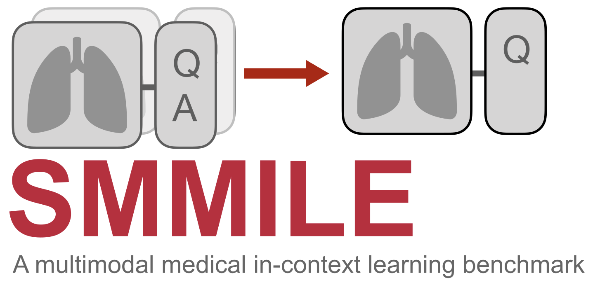

# SMMILE: A Benchmark for Multimodal Medical In-Context Learning

<div align="center">
  
</div>

[](https://www.python.org/downloads/)
[](https://huggingface.co/datasets/smmile/SMMILE)
[](https://arxiv.org/abs/2506.21355)

## Introduction

Multimodal in-context learning (ICL) remains underexplored despite the profound potential it could have in complex application domains such as medicine. Clinicians routinely face a long tail of tasks which they need to learn to solve from few examples, such as considering few relevant previous cases or few differential diagnoses. While MLLMs have shown impressive advances in medical visual question answering (VQA) or multi-turn chatting, their ability to learn multimodal tasks from context is largely unknown.

We introduce **SMMILE** (Stanford Multimodal Medical In-context Learning Evaluation), the first multimodal medical ICL benchmark. A set of clinical experts curated ICL problems to scrutinize MLLM's ability to learn multimodal tasks at inference time from context.

## Dataset Access

The SMMILE dataset is available on HuggingFace:

```python
from datasets import load_dataset
load_dataset('smmile/SMMILE', token=YOUR_HF_TOKEN)
load_dataset('smmile/SMMILE-plusplus', token=YOUR_HF_TOKEN)
```

Note: You need to set your HuggingFace token as an environment variable:
```bash
export HF_TOKEN=your_token_here
```

## Repository Structure

```
.
├── README.md                                 # This file
├── requirements.txt                          # Python dependencies to run inference and evaluation
├── figures/                                  # Figures and assets
├── missing_images/                           # Manually downloaded images
├── results/                                  # Inference results on SMMILE
├── results_augmented/                        # Inference results on SMMILE++
└── inference_and_evaluation/                 # All inference and evaluation scripts
    ├── inference_{model}.py                  # Inference script for Model {model}
    ├── evaluate_EM.py                        # Evaluation of open-ended questions with exact match
    ├── evaluate_LLMJudge.py                  # Evaluation of open-ended questions with LLM-as-a-Judge 
    ├── stratify.py                           # Evaluation stratified by problem characteristics (flags)
    ├── variance_analysis.py                  # Bootstrapping to account for uncertainty in models' responses
    └── utils.py                              # Helper methods, needed for some inference scripts
```

## Installation and Dependencies

This project requires **Python 3.10**. 

### Critical Version Requirements

This project requires specific package versions to function correctly:
```bash
pip install transformers==4.51.0
pip install accelerate==1.6.0
pip install flash_attn --no-build-isolation
```

Install all dependencies:
```bash
pip install -r requirements.txt
```

### GPU Support

For GPU acceleration:
- NVIDIA GPU users: Install appropriate CUDA drivers separately
- Verify GPU availability:
```python
import torch
print(f"CUDA available: {torch.cuda.is_available()}")
print(f"GPU count: {torch.cuda.device_count()}")
```

### Handling Missing Images

Some images may be missing from the dataset. The inference script will print URLs for manual download. Save these images to the `missing_images` directory specified with the `--image-dir` argument.

## Running the Benchmark

All inference and evaluation scripts are located in the `inference_and_evaluation/` directory. Navigate there first:

```bash
cd inference_and_evaluation
```
### Common Arguments

All inference scripts support these common arguments:
- `--inference_mode`: `ICL` or `0-shot`
- `--output-dir`: Custom output directory (default: `../results`)
- `--gpu-devices`: GPU device selection (e.g., `0,1`)
- `--task_format`: `open` or `mcqa` (where applicable)

Optionally, one can specify SMMILE++ as dataset:
- `--dataset`: `augmented` (argument for SMMILE++, default dataset: SMMILE)

For example,

#### Qwen Models
Available models: 3B, 7B, 32B, 72B

```bash
# Run all models in ICL mode with open-ended questions
python inference_qwen.py --inference_mode ICL --models all --task_format open

# Run specific models with multiple-choice questions
python inference_qwen.py --inference_mode 0-shot --models 7B 32B --task_format mcqa

# Use SMMILE++ (augmented) dataset
python inference_qwen.py --inference_mode ICL --models 72B --dataset augmented

# Combine augmented dataset with MCQA format
python inference_qwen.py --inference_mode ICL --models 3B --task_format mcqa --dataset augmented
```


#### Llama 3.2 Vision 90B
```bash
# Standard SMMILE dataset
python inference_llama32v.py --inference_mode ICL --task_format open --gpu_devices 0,1

# SMMILE++ dataset with multiple-choice questions
python inference_llama32v.py --inference_mode ICL --task_format mcqa --dataset augmented
```


#### MedVLM-R1 Model

```bash
# Open-ended questions on SMMILE
python inference_medr1.py --inference_mode ICL --task_format open --gpu_devices 0,1

# Multiple-choice questions on SMMILE++
python inference_medr1.py --inference_mode ICL --task_format mcqa --dataset augmented
```

#### MedGemma Models

```bash
# Standard inference
python inference_medgemma.py --inference_mode ICL --task_format open

# SMMILE++ with multiple-choice format
python inference_medgemma.py --inference_mode ICL --task_format mcqa --dataset augmented
```

#### LLaVA Models, LlaVA-Med
**Special Requirements:** `transformers==4.46.3`, `torch==2.2.0`

Available models: `llava_7b`, `llava_13b`, `llavanext_7b`, `llavaonevision_7b`, `llavaonevision_0.5b` 


```bash
# Open-ended questions (standard script)
python inference_llava.py --inference_mode ICL --model_name llava_7b
python inference_llava.py --inference_mode ICL --model_name llava_7b --dataset augmented
python inference_llava_mcqa.py --inference_mode ICL --model_name llava_7b --task_format mcqa --dataset augmented

# LlaVA-Med
python inference_llavamed.py --inference_mode ICL --model_name llava_7b
python inference_llavamed.py --inference_mode ICL --model_name llava_7b --dataset augmented
python inference_llavamed_mcqa.py --inference_mode ICL --model_name llava_7b --task_format mcqa --dataset augmented
```


### API-Based Models

**Claude Models**
```bash
# Set API key
export ANTHROPIC_API_KEY="your-key-here"

# Run inference on SMMILE
python inference_anthropic.py --inference_mode ICL --task_format open

# Run on SMMILE++ with multiple-choice questions
python inference_anthropic.py --inference_mode ICL --task_format mcqa --dataset augmented
```

**OpenAI GPT-4o Models**
```bash
# Set API credentials
export AZURE_OPENAI_API_KEY="your-key-here"
export AZURE_OPENAI_ENDPOINT="your-endpoint-here"
export AZURE_OPENAI_API_VERSION="2024-05-01-preview"

# Run inference on SMMILE
python inference_openai.py --model gpt-4o --inference_mode ICL --task_format open

# Run on SMMILE++ with multiple-choice questions
python inference_openai.py --model gpt-4o --inference_mode ICL --task_format mcqa --dataset augmented
```

#### Baseline Models

**Llama 3.3 Text-Only Baseline**
```bash
# Install and setup ollama
curl -fsSL https://ollama.com/install.sh | sh
ollama serve
ollama pull llama3.3
pip install ollama

# Run inference
python inference_llama33textonly.py --inference_mode ICL
python inference_llama33textonly_mcqa.py --inference_mode ICL --task_format mcqa --dataset augmented
```

**Statistical Baselines**
```bash
# Random or majority baselines
python inference_baselines.py --baseline random --inference_mode ICL --task_format open
python inference_baselines.py --baseline majority --inference_mode ICL --task_format mcqa --dataset augmented
```

## Evaluation

**Note:** Make sure you're in the `inference_and_evaluation/` directory before running evaluation commands:
```bash
cd inference_and_evaluation
```

### Exact Match Evaluation
```bash
# Evaluate all models with flexible matching
python evaluate_EM.py ../results

# Strict matching or specific model
python evaluate_EM.py ../results --strict-match --model qwen72B --inference-mode ICL
```

### LLM-as-a-Judge Evaluation
**Requirements:** ollama with Llama 3.3 (see text-only baseline setup above)

```bash
# Evaluate all models
python evaluate_LLMJudge.py ../results

# Visualize existing results without re-evaluation
python evaluate_LLMJudge.py ../results --visualize-only
```

### Stratified Analysis
```bash
# Analyze performance by problem characteristics
python stratify.py ../results --eval_type em --model qwen72B
python stratify.py ../results --eval_type llm --inference-mode ICL
```

### Statistical Variance Analysis
```bash
# Full statistical analysis with bootstrap confidence intervals
python variance_analysis.py ../results

# Generate LaTeX table
python variance_analysis.py ../results --generate_table --latex_output results_table.tex
```

## License

This work is licensed under a [Creative Commons Attribution 4.0 International License](http://creativecommons.org/licenses/by/4.0/).

## References

[1] Wang, P., Bai, S., Tan, S., Wang, S., Fan, Z., Bai, J., Chen, K., Liu, X., Wang, J., Ge, W., Fan, Y., Dang, K., Du, M., Ren, X., Men, R., Liu, D., Zhou, C., Zhou, J., & Lin, J. (2024). Qwen2-VL: Enhancing Vision-Language Model's Perception of the World at Any Resolution. arXiv preprint arXiv:2409.12191.

[2] Pan, J., Liu, C., Wu, J., Liu, F., Zhu, J., Li, H. B., Chen, C., Ouyang, C., & Rueckert, D. (2025). MedVLM-R1: Incentivizing Medical Reasoning Capability of Vision-Language Models (VLMs) via Reinforcement Learning. arXiv preprint arXiv:2502.19634.

[3] Liu, H., Li, C., Wu, Q., & Lee, Y. J. (2024). Visual Instruction Tuning. IEEE Transactions on Pattern Analysis and Machine Intelligence.

[4] Liu, H., Li, C., Li, Y., & Lee, Y. J. (2023). Improved Baselines with Visual Instruction Tuning. arXiv:2310.03744.

[5] Li, B., Zhang, Y., Guo, D., Zhang, R., Li, F., Zhang, H., Zhang, K., Li, Y., Liu, Z., & Li, C. (2024). LLaVA-OneVision: Easy Visual Task Transfer. arXiv:2408.03326.

[6] Shi, H., Wang, R., Zhang, J., Weng, L., Li, Y., Hao, C., Liu, F., You, C., Leskovec, J., Tai-Seale, M., Sun, P., Fung, P., Zou, J., & Rajpurkar, P. (2024). LLaVA-Med-V1.5: Enhanced Vision-Language Foundation Model for Medical Applications. arXiv preprint arXiv:2404.02656.

[7] Li, C., Wong, C., Zhang, S., Usuyama, N., Liu, H., Yang, J., Naumann, T., Poon, H., & Gao, J. (2023). Llava-med: Training a large language-and-vision assistant for biomedicine in one day. arXiv preprint arXiv:2306.00890.

## Acknowledgments

We thank the clinical experts who contributed to curating the benchmark dataset.